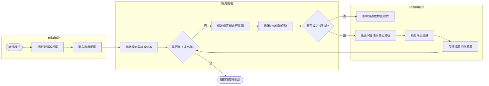
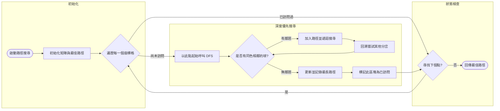

# 📊 Collect-Em-All 專案詳細邏輯流程圖

## 1️⃣ 主程式執行流程 (Detailed Main Flow)

```mermaid
graph LR
    subgraph 啟動階段
    A([執行程式]) --> B[啟動瀏覽器視窗]
    B --> C[載入遊戲網頁]
    end

    subgraph 偵測循環
    C --> D[辨識框架與縮放倍率]
    D --> E{是否按下退出鍵?}
    E -- 否 --> F[對遊戲區域進行截圖]
    F --> G[辨識6×6球體矩陣]
    G --> H{是否成功找到球?}
    end

    subgraph 決策與執行
    H -- 否 --> I[回報錯誤並停止程式]
    H -- 是 --> J[透過演算法找最長路徑]
    J --> K[模擬滑鼠連線]
    K --> L[等待遊戲消除動畫]
    L --> E
    end

    E -- 是 --> M([關閉瀏覽器結束])
```

---

## 2️⃣ 核心演算法：最長路徑搜尋 (Detailed DFS)

```mermaid
flowchart LR
    subgraph 初始化
    Start([啟動路徑搜尋]) --> Init[初始化矩陣與最佳路徑]
    Init --> Loop{遍歷每一個座標格}
    end

    subgraph 狀態檢查
    Loop -- 已訪問過 --> Next{尋找下個點?}
    Next -- 是 --> Loop
    Next -- 否 --> End([回傳最佳路徑])
    end

    subgraph 深度優先搜尋
    Loop -- 尚未訪問 --> Call[以此點起始呼叫 DFS]
    Call --> Check{是否有同色相鄰的球?}
    
    Check -- 有鄰居 --> Forward[加入路徑並遞迴搜尋]
    Forward --> Back[回溯嘗試其他分岔]
    Back --> Check
    
    Check -- 無鄰居 --> Update[更新並記錄最長路徑]
    Update --> Mark[標記此區塊為已訪問]
    Mark --> Next
    end
```
