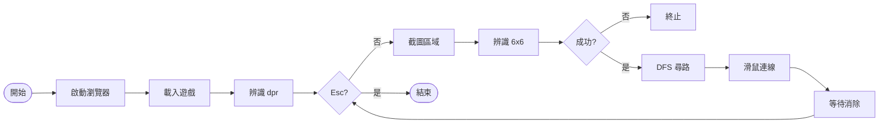
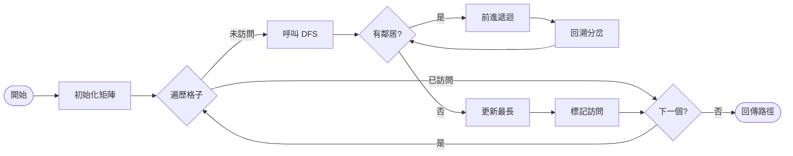

# 📊 Collect-Em-All 專案邏輯流程圖

## 1️⃣ 主程式執行流程 (Main Execution Flow)

```mermaid
graph LR
    A([開始]) --> B[啟動瀏覽器]
    B --> C[載入遊戲]
    C --> D[辨識 dpr]
    D --> E{Esc?}
    E -- 否 --> F[截圖區域]
    F --> G[辨識 6x6]
    G --> H{成功?}
    H -- 否 --> I[終止]
    H -- 是 --> J[DFS 尋路]
    J --> K[滑鼠連線]
    K --> L[等待消除]
    L --> E
    E -- 是 --> M([結束])
```

---

## 2️⃣ 核心演算法: DFS 尋找最長路徑

```mermaid
flowchart LR
    Start([開始]) --> Init[初始化矩陣]
    Init --> Loop{遍歷格子}
    
    Loop -- 已訪問 --> Next{下一個?}
    Next -- 是 --> Loop
    Next -- 否 --> End([回傳路徑])
    
    Loop -- 未訪問 --> Call[呼叫 DFS]
    Call --> Check{有鄰居?}
    
    Check -- 是 --> Forward[前進遞迴]
    Forward --> Back[回溯分岔]
    Back --> Check
    
    Check -- 否 --> Update[更新最長]
    Update --> Mark[標記訪問]
    Mark --> Next
```
