# 📊 Collect-Em-All 專案邏輯流程圖 (Project Logic Flowcharts)

## 1️⃣ 主程式執行流程 (Main Execution Flow)
此流程描述了從啟動瀏覽器、自動辨識網頁元素到模擬滑鼠動作的完整自動化循環。

```mermaid
graph LR
    A[開始執行 main] --> B[啟動 Playwright 瀏覽器]
    B --> C[前往遊戲網頁並等待載入]
    C --> D[辨識 iframe 位置與螢幕縮放倍率 dpr]
    D --> E{是否按下 Esc 鍵?}
    E -- 否 --> F[對遊戲區域截圖 current_game_area.png]
    F --> G[執行 read_matrix: 辨識 6x6 球體顏色與座標]
    G --> H{辨識成功 36 顆球?}
    H -- 否 --> I[報錯並終止]
    H -- 是 --> J[執行 find_longest_move: 尋找最長路徑]
    J --> K[執行 drag_path: 模擬滑鼠拖曳連線]
    K --> L[根據連線長度等待遊戲動畫]
    L --> E
    E -- 是 --> M[關閉瀏覽器並結束]
```

## 2️⃣ 核心演算法：尋找最長路徑 (DFS Logic)
此流程詳解了如何透過深度優先搜尋（DFS）與回溯法（Backtracking）在 6x6 矩陣中找出最長同色連線。

```mermaid
flowchart LR
    Start([開始尋找最長連線]) --> Init[初始化 visited 矩陣與 best_path]
    Init --> LoopStart{遍歷所有格子 i, j}
    
    LoopStart -- 已訪問或未結束 --> Next{還有下一個點?}
    Next -- 是 --> LoopStart
    Next -- 否 --> End([回傳 best_path])
    
    LoopStart -- 未訪問 --> CallDFS[以此點為起點呼叫 DFS]
    CallDFS --> DFSCheck{是否有可連線且未在路徑中的球?}
    
    DFSCheck -- 是 --> Forward[前進: 加入路徑並遞迴呼叫]
    Forward --> Backtrack[回溯: 移除該點嘗試其他分岔]
    Backtrack --> DFSCheck
    
    DFSCheck -- 否 --> Compare[更新目前區域內的最長路徑]
    Compare --> MarkVisited[將此區域所有點標記為已訪問]
    MarkVisited --> Next
```

